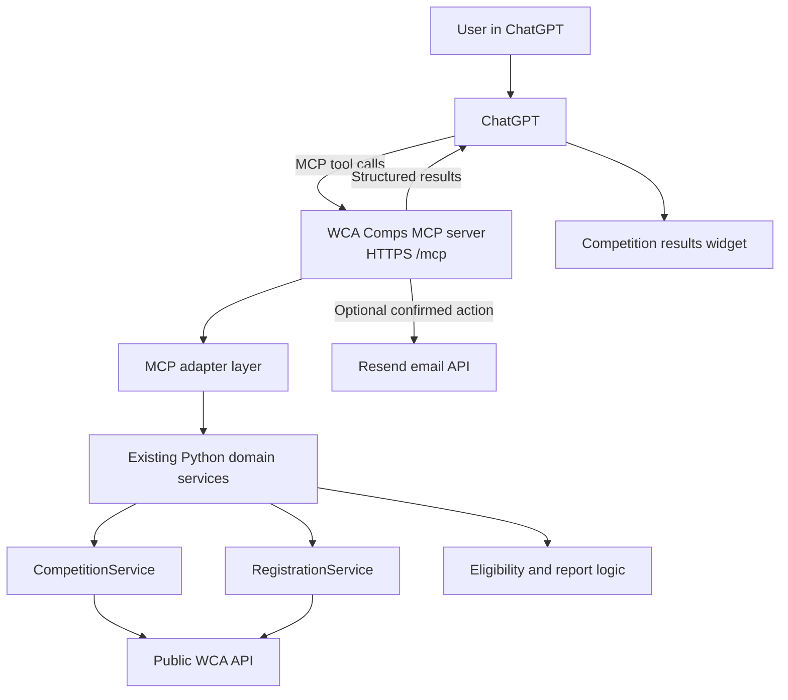

# WCA Competition Finder — ChatGPT App Architecture

## Goal

Turn the existing WCA Competition Finder into a ChatGPT App that can find upcoming competitions, check a competitor's registration status, explain registration eligibility, and optionally email a report.

The recommended implementation is an OpenAI Apps SDK application backed by a Model Context Protocol (MCP) server. The existing Python services remain the source of truth for WCA API access and eligibility logic.

## High-level architecture



## Architectural principles

- Reuse the existing Python domain and networking modules.
- Keep ChatGPT integration in a thin MCP adapter layer.
- Return structured JSON from data tools instead of preformatted text.
- Keep data retrieval and UI rendering as separate tools.
- Treat email delivery as a confirmed write action, not part of the read-only search flow.
- Avoid user authentication for the MVP because the required WCA information is publicly available.
- Do not persist WCA IDs, names, email addresses, or report history unless personalization later requires it.

## Proposed MCP tools

### `search_wca_competitions`

Find competitions and assess registration status for a competitor.

Inputs:

```json
{
  "wca_id": "2023VONT01",
  "person_name": "Saharsh Sai Vontela",
  "regions": ["Washington", "Oregon", "British Columbia"],
  "from_date": "2026-08-01"
}
```

Output fields should include:

- Competition ID, name, dates, location, venue, and URL
- Region and event IDs
- Registration opening and closing timestamps
- Competitor count and limit
- Competitor registration status and registered events
- Computed registration state
- `can_register` and a human-readable reason
- Summary counts for registered, available, and unavailable competitions

Annotations:

- `readOnlyHint: true`
- `openWorldHint: true`

### `render_competition_results`

Render a previously prepared structured result as an Apps SDK widget. This tool should not refetch the same data.

Annotations:

- `readOnlyHint: true`
- Associate the tool with the widget resource URI.

### `email_competition_report`

Send a report only after the user explicitly requests and confirms delivery.

Inputs:

- Recipient email address
- Prepared competition result or stable report identifier

Requirements:

- Mark as non-read-only and external-action capable.
- Require confirmation before sending.
- Read `RESEND_API_KEY` only from the deployment environment.
- Never return or log API keys.
- Return only delivery status and the intended recipient.

This tool should be added after the read-only MVP is stable.

## Python application changes

The following existing modules should remain reusable:

| Module | Role in the ChatGPT App |
| --- | --- |
| `wca_comps/networking.py` | HTTP client, retry handling, pagination, and TLS |
| `wca_comps/competitions.py` | Competition retrieval and regional filtering |
| `wca_comps/registrations.py` | Registration lookup through public WCIF documents |
| `wca_comps/models.py` | Typed domain models |
| `wca_comps/report.py` | Eligibility calculation and optional email rendering |
| `wca_comps/notify.py` | Optional Resend delivery action |

Required refactoring:

1. Accept competitor, regions, and starting date as runtime inputs.
2. Add strict validation for WCA IDs, dates, and supported regions.
3. Add serializers that convert domain models into stable MCP output schemas.
4. Keep text and HTML reports for email, but use structured content for ChatGPT.
5. Fetch independent WCIF registration records concurrently.
6. Add short-lived caching for competition lists and public WCIF documents.
7. Return clear typed errors for invalid input, WCA API failures, timeouts, and no-result cases.

## ChatGPT widget

The widget should be responsive and usable on ChatGPT web and mobile clients.

Display three sections:

1. **Already registered** — green accent
2. **Registration open** — blue accent
3. **Unavailable or not yet open** — gray accent

Each competition card should display:

- Name and region
- Dates and location
- Event list
- Registration window
- Competitor count, capacity, or remaining spots
- Registration and eligibility status
- Link to the official WCA competition page

Useful controls include region filters, category tabs, and a refresh action. The component should consume structured tool output rather than parse report text.

## Deployment architecture

Deploy the Python MCP server to a host that provides a stable public HTTPS endpoint, such as Google Cloud Run, Render, Railway, or Fly.io.

Production requirements:

- Public HTTPS `/mcp` endpoint
- Health-check endpoint
- Environment-based secrets
- Request timeouts and bounded retries
- Response caching
- Structured logs without personal data or secrets
- Explicit content security policy for widget network domains
- Privacy policy and support URLs before public submission
- Monitoring for latency, WCA API failures, and email-delivery errors

## Development and testing workflow

### Local development

1. Add the MCP SDK and server entrypoint.
2. Register the read-only search and render tools.
3. Test schemas and raw responses with MCP Inspector.
4. Expose the local server using OpenAI Secure MCP Tunnel, Cloudflare Tunnel, or ngrok.
5. Enable ChatGPT Developer Mode.
6. Create a connector pointing to the HTTPS `/mcp` endpoint.
7. Refresh connector metadata after tool-schema changes.

### Automated tests

- Unit tests for date parsing, eligibility, registration windows, capacity, and status handling
- Mocked WCA API tests for pagination, rate limiting, retries, timeouts, and malformed responses
- MCP contract tests for input and output schemas
- Widget tests for empty, loading, error, and populated states
- Golden-prompt tests for direct, indirect, and negative tool-selection cases

Important scenarios:

- Invalid WCA ID
- No competitions found
- WCA API unavailable
- Registration not open yet
- Registration closed
- Competition at capacity or waitlist-only
- Competitor pending, accepted, deleted, or not registered
- Widget behavior on ChatGPT web and mobile

## Delivery plan

### Milestone 1 — Structured application core

- Parameterize competitor, regions, and date.
- Add stable structured result models.
- Add validation, concurrency, caching, and tests.

### Milestone 2 — Read-only MCP server

- Implement `search_wca_competitions`.
- Add MCP schemas, metadata, annotations, and error handling.
- Verify behavior with MCP Inspector.

### Milestone 3 — ChatGPT widget

- Implement `render_competition_results`.
- Build responsive grouped competition cards.
- Test web and mobile layouts.

### Milestone 4 — Private deployment

- Deploy to a stable HTTPS host.
- Connect through ChatGPT Developer Mode.
- Measure latency and iterate on tool descriptions and results.

### Milestone 5 — Optional email action

- Implement `email_competition_report`.
- Add explicit confirmation and secret handling.
- Add privacy and delivery-failure tests.

### Milestone 6 — Public release

- Complete publisher verification.
- Add production CSP, privacy policy, support URL, logo, screenshots, and test prompts.
- Run web and mobile acceptance tests.
- Submit the app through the OpenAI Platform review flow.

## Security and privacy

- Use the public WCA API only for the MVP.
- Never embed Resend or OpenAI secrets in source code or client-side widget assets.
- Minimize returned personal information to what the user explicitly requested.
- Do not include internal request IDs, logs, tokens, or debug payloads in tool results.
- Apply rate limits and input-size limits at the MCP boundary.
- Sanitize all values rendered in the widget.
- Require confirmation for email and any future state-changing action.

## Initial success criteria

The MVP is complete when a user can ask ChatGPT for upcoming competitions using a WCA ID and selected regions, receive accurate grouped registration results in a responsive widget, open official WCA links, and get useful errors when data is unavailable—all without authentication or persistent storage.

## References

- [OpenAI Apps SDK quickstart](https://developers.openai.com/apps-sdk/quickstart)
- [Define tools](https://developers.openai.com/apps-sdk/plan/tools)
- [Build an MCP server](https://developers.openai.com/apps-sdk/build/mcp-server)
- [Connect from ChatGPT](https://developers.openai.com/apps-sdk/deploy/connect-chatgpt)
- [Submit and maintain an app](https://developers.openai.com/apps-sdk/deploy/submission)
